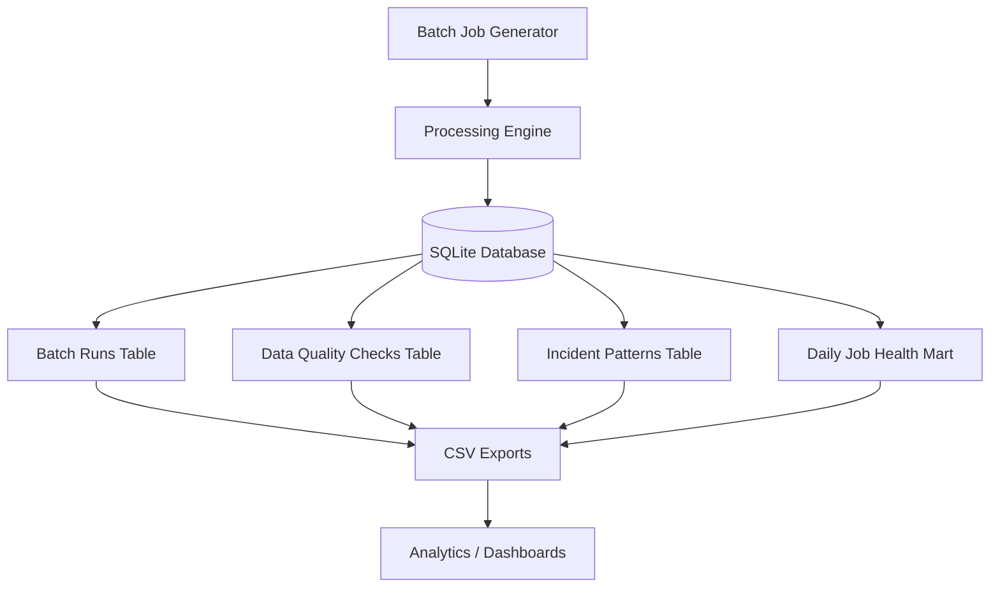

# PipelinePulse 🚀  
A production-inspired ETL pipeline for simulating batch pipelines, monitoring job health, detecting failures, and generating analytics-ready datasets.

Author: Maharshi Roy  
GitHub: https://github.com/MaharshiRoy  

---

## 🎯 Overview

PipelinePulse models real-world batch data workflows by generating job runs, tracking failures, detecting SLA breaches, performing data quality checks, identifying recurring incident patterns, and producing analytics-ready datasets.

It is designed to emulate how modern data platforms monitor and maintain batch pipelines in production environments, with a focus on reliability, observability, and operational insights.

---

## 🚀 Why this project?

Built to simulate how real-world data platforms monitor batch pipelines, detect failures, and maintain reliability at scale.

Inspired by production systems handling 100+ daily batch jobs.

## 🏗️ Architecture


## 🔍 Key Components

- Batch Job Generator: Simulates recurring job executions with configurable parameters
- Processing Engine: Applies logic for failures, SLA tracking, and metrics generation
- SQLite Database: Stores structured job, run, and quality data
- Analytics Layer: Builds marts for monitoring job health and reliability
- Export Layer: Produces CSV datasets for downstream analysis


## 🚀 Key Features

- Batch job simulation across multiple domains and owners
- SLA breach detection and runtime tracking
- Data quality validation with pass/fail checks
- Failure classification and recurring incident pattern detection
- SQL-friendly schema design for analytical querying
- Exportable datasets for downstream visualization and reporting


## 🧰 Tech Stack

- Python
- SQLite
- SQL
- CSV exports


## 🌍 Real-World Relevance

This project reflects how data teams:

- Monitor ETL pipeline health in production  
- Detect and debug recurring failures  
- Track SLA compliance and performance  
- Build data marts for operational dashboards  

Concepts used here are directly aligned with enterprise data platforms.

## 🔄 Pipeline Flow
1. Extract raw data  
2. Transform and clean data  
3. Validate processed data  
4. Load into structured format  
5. Log execution and failures  


## 📊 Key Focus
- Reliability of data workflows  
- Failure detection and debugging  
- Structured pipeline design  
- Real-world ETL simulation  

## 📌 Key Learnings

- Designing reliable data pipelines requires strong validation and monitoring  
- Logging and observability are critical for debugging production issues  
- Structured data models enable efficient analytics and reporting  
- Failure patterns can be used to proactively improve system reliability


## ▶️ Run Locally

```powershell
python src/pipelinepulse.py --db artifacts/service_ops_demo.sqlite --days 21 --seed 42 --export-dir artifacts/exports
```

📦 Outputs:

```text
artifacts/service_ops_demo.sqlite
artifacts/exports/batch_jobs.csv
artifacts/exports/batch_runs.csv
artifacts/exports/data_quality_checks.csv
artifacts/exports/incident_patterns.csv
artifacts/exports/mart_daily_job_health.csv
```

## ⚙️ System Simulation

- 10 recurring batch jobs
- 21 days of job runs by default
- Success and failure states
- SLA breach detection
- Row count metrics
- Data quality checks
- Recurring incident pattern detection
- Daily job health mart

## 🧱 Data Model

| Table | Purpose |
| --- | --- |
| `batch_jobs` | Job metadata such as domain, owner, SLA, and criticality |
| `batch_runs` | Run-level status, duration, row counts, and error details |
| `data_quality_checks` | Check-level pass/fail results |
| `incident_patterns` | Repeated error patterns and recommendations |
| `mart_daily_job_health` | Daily reliability mart for dashboarding |


